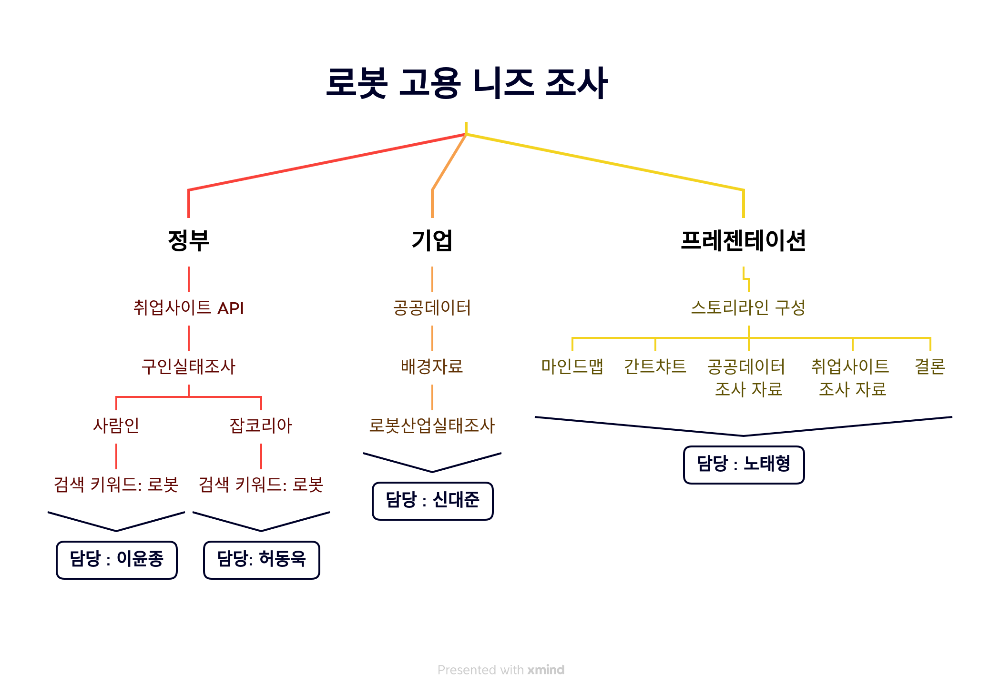
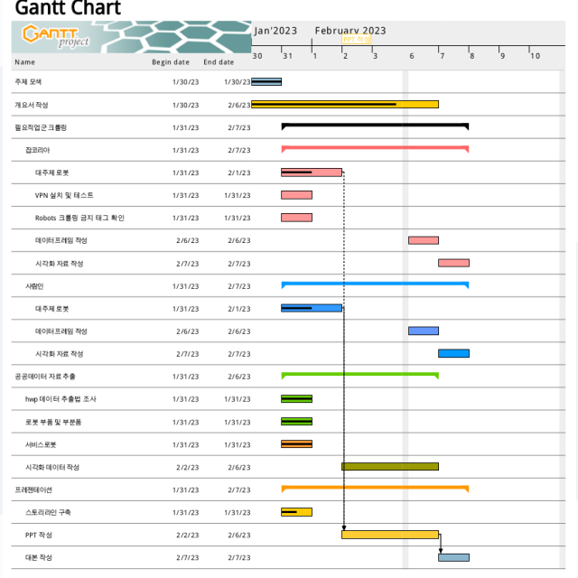
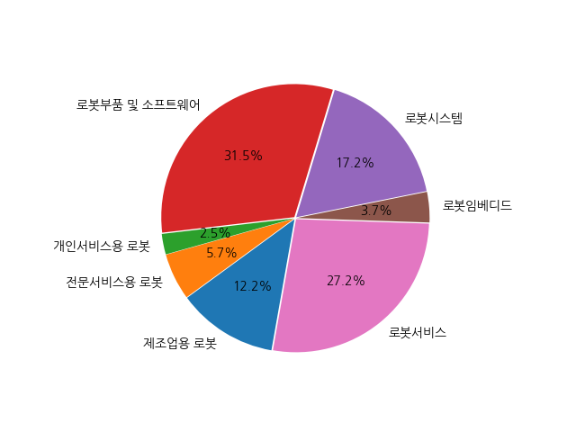

# eda-repo-2
EDA 프로젝트 2조 저장소. 로봇 개발자 취업현황 조사

  

# 팀원
[노태형](https://github.com/Robotics-Ro): 프로젝트 기획 및 데이터 시각화 (WBS 및 Gantt Chart 작성) \
[신대준](https://github.com/shindaejune): 공공데이터 가공 (python, pandas, folium) \
[이윤종](https://github.com/doubleSizeBanana): 사람인 크롤링 및 데이터 시각화 (Selenium, pandas, folium) \
[허동욱](https://github.com/dongwookheo): 잡코리아 크롤링(중단) 및 데이터 시각화 (Selenium, BeautifulSoup, pandas, folium)
=================================================================
 

# 목차

## 1.개요 및 진행
## 2. 공공데이터
## 3. 크롤링
## 4. 결과 보고

-----------------------------------------------------------------

# 1. 개요 및 진행
 ## **<니즈 조사를 위한 WBS를 작성 및 역할 분담> **

 
 
## **<WBS를 토대로 스케쥴 작성>**

- ## 노란색 : 노태형, &nbsp;&nbsp;&nbsp; 분홍색 : 허동욱
- ## 파란색 : 이윤종, &nbsp;&nbsp;&nbsp; 초록색 : 신대준

------------------------------------------
# 2. 공공데이터
# 국내 로봇산업 분포
## 총 4310개 중 
# 1위 로봇 부품 빛 소프트웨어 1360 &nbsp; 구성비 &nbsp;31.5% 
   여러 종류의 로봇에 사용되는 중간 생산물.  다른 중간재와의 결합을 통하여 최종재의 경쟁력을 결정하는 핵심요소 
# 2위 로봇서비스 &emsp;&emsp;&emsp;&emsp; 1175 &nbsp;구성비&nbsp; 27.2% 
로봇을 활용하여 사람에게 필요로 하는 신체적, 정신적 서비스를 제공하는 행위 
# 3위 로봇시스템&emsp;&emsp;&emsp;&emsp;&emsp;   742 구성비 &nbsp;17.2%
로봇을 포함하여 기계, 장치 등을 조합하여 필요한 기능을 실현한 집합체

  
